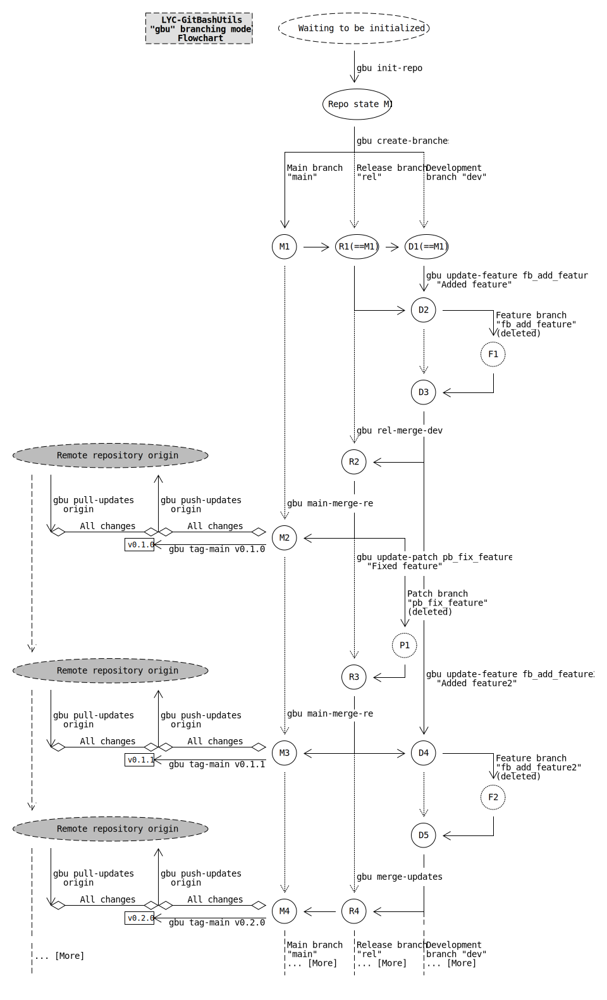

<!---
Copyright 2022 Yucheng Liu. GNU GPL3 lincense.
GNU GPL3 license copy: https://www.gnu.org/licenses/gpl-3.0.txt
--->

# LYC-GitBashUtils

A Git Bash utility application I write for software engineering purposes.

Properly updating a multi-branch Git repository typically requires dozens of Git Bash commands or dozens of clicks on the Git GUI.

I write this application with the hope that it can save the users from endlessly and repeatedly typing series of Git Bash commands or clicking on certain elements of the Git GUI when updating their repositories.

In many of my projects, this application saved me the time to enter multiple Git Bash commands on my terminals.

It also saved me the time to think about the right command combination to use when updating my repositories.

It lets me focus on the software codes to update and gives me a better software developing experience.

This application, formerly an utility collection, manages to **control the version of itself** in a Git Bash environment since version `0.2.2`.

# Important Notes

This utility collection contains potentially **batch and bulk `git` operations**.

I strongly recommend you to **run and check `git status` and `git log`** before running the commands in this app.

# Installation

- Download the source code.
- Install the app. (Optional. See below.)
- Run the app in the following ways.

## Bash Environment Installation

- I recommend you to install the app in this way.
- Go to the root directory of this repository.
- Run the `./install.bash` command.
- This will install the application to `~/.bash_profile` and `~/.bashrc`.
- Upon uninstallation, remember to run the `./uninstall.bash` command.
- Run `gbu` and its sub-commands from a GNU Bash shell.

## Direct Script Execution

- You can run the app in this way without a Bash environment installation.
- Directly run the Bash scripts in the `lyc-git-bash-utils/exes` folder of this repository.
- You can make a shortcut to the `exes` folder at somewhere you like to get access to the scripts more easily.

# Usage (From a GNU Bash shell with `git`)

`gbu`:

The main command and entry to the sub-commands.
Short for `Git Bash Utilities`.

`gbu help`:

The help subcommand.
Shows detailed help information.

# `gbu` Branching Model

This application implements the `gbu` branching model.

The `gbu` branching model is a branching model I designed for this application based on my past software developing experience.

I am continuously refining this model as I am updating this application.

A flowchart of the current `gbu` branching model is attached as an SVG image below.



# `gbu help` Help Page
```bash
$ gbu help
Usage: gbu <command> ...
==== Commands ====
help:
    When:   You need help info. For example, now.
    How-to: gbu help
info:
    When:   You need too see the package info.
    How-to: gbu info
list-main-names:
    When:   You need to list the main branch name settings
    How-to: gbu list-main-names
clear-main-names:
    When:   You need to restore the default main branch name settings.
    How-to: gbu clear-main-names
set-main-name:
    When:   You need to update the main branch name settings.
    How-to: gbu set-main-name <new-main-name>
list-user-info:
    When:   You need to list the git user info.
    How-to: gbu list-user-info
set-user-info:
    When:   You need to update the git user info.
    How-to: gbu set-user-info <name> <email>
show-graph:
    When:   You need to show the git branch graph.
    How-to: gbu show-graph
create-rel:
    When:   You need to create a rel (release) branch.
    How-to: gbu create-rel
create-dev:
    When:   You need to create a dev (develop) branch.
    How-to: gbu create-dev
init-repo:
    When:   You need to initialize the current repository.
    How-to: gbu init-repo
dev-merge-rel:
    When:   You need the dev branch to merge the rel branch.
    How-to: gbu dev-merge-rel
update-feature:
    When:   You need to update a feature with a feature branch.
    How-to: gbu update-feature <feature-branch-name> <feature-commit-message>
rel-merge-dev:
    When:   You need the rel branch to merge the dev branch.
    How-to: gbu rel-merge-dev
update-patch:
    When:   You need to update a patch with a patch branch.
    How-to: gbu update-patch <patch-branch-name> <patch-commit-message>
main-merge-rel:
    When:   You need the main branch to merge the rel branch.
    How-to: gbu main-merge-rel
merge-updates:
    When:   You need rel to merge dev, and then main to merge rel.
    How-to: gbu merge-updates
tag-main:
    When:   You need to tag the latest commit on the main branch.
    How-to: gbu tag-main <tag-name>
push-updates:
    When:   You need to push the local updates to a remote repository.
    How-to: gbu push-updates [<optional-remote>]
pull-updates:
    When:   You need to pull the updates from a remote repository.
    How-to: gbu pull-updates [<optional-remote>]
```

# Miscellaneous
## Versioning

```text
The versioning of this app is based on Semantic Versioning.
You can see the complete Semantic Versioning specification from
  https://semver.org/.
Basically, the version name of this app is in the form of:
  x.y.z
  Where x, y, and z are integers that are greater than or equal to 0.
  Where x, y, and z are separated by dots.
  x stands for the major version and indicates non-compatible major changes to
    the app.
  y stands for the minor version and indicates forward compatible minor
    changes to the app.
  z stands for the patch version and indicates bug fixes and patches to the
    app.
```

## Version Tags

```text
The version tags of this repo has the form of a letter "v" followed by a
  semantic version.
Given a semantic version:
  $x.$y.$z
  Where $x, $y, and $z are the semantic major, minor, and patch versions.
The corresponding version tag would be:
  v$x.$y.$z
The version tags are on the main branch.
```

## Developer's Notes

This app is distributed under the **GNU GPL3 license**.

The works that **contains or integrates any part of this app must also be distributed under the GNU GPL3 license**.

The works that are managed using this utility collection do not have to be distributed under the GNU GPL3 license.

However, if you find this utility collection useful, I encourage you to also distribute a selection your works under the GNU GPL3 license as your contribution to the open-source community.

## Copyright
### Short Version

```text
Copyright (C) 2022 Yucheng Liu. GNU GPL3 license (GNU General Public License
  Version 3).
You should have and keep a copy of the above license. If not, please get it
  from https://www.gnu.org/licenses/gpl-3.0.txt.
```

### Long Version

```text
LYC-GitBashUtils, LYC's personal Git Bash utility application.
Copyright (C) 2022 Yucheng Liu. GNU GPL3 license (GNU General Public License
  Version 3).

This program is free software: you can redistribute it and/or modify it under
  the terms of the GNU General Public License as published by the Free
  Software Foundation, either version 3 of the License, or (at your option)
  any later version.

This program is distributed in the hope that it will be useful, but WITHOUT
  ANY WARRANTY; without even the implied warranty of MERCHANTABILITY or
  FITNESS FOR A PARTICULAR PURPOSE. See the GNU General Public License for
  more details.

You should have received a copy of the GNU General Public License along with
  this program. If not, see:
  1. The LICENSE file in this repository.
  2. https://www.gnu.org/licenses/.
  3. https://www.gnu.org/licenses/gpl-3.0.txt.
```
